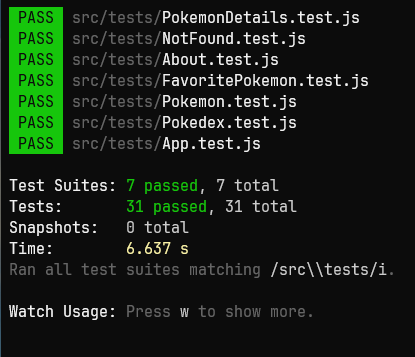

# React Testing Library



# Índice

* [Título e Imagens Home](#react-testing-library)
* [tecnologias utilizadas](#tecnologias-utilizadas)
* [Descrição do projeto](#descrição-do-projeto)
* [Status do Projeto](#status-do-projeto)
* [Funcionalidade do projeto](#🔨-funcionalidade-do-projeto)
* [Acesso ao Projeto](#acesso-ao-projeto)

# Tecnologias utilizadas


# Descrição do Projeto

O projeto "React Testing Library" é parte do currículo da formação de Desenvolvedor Web da [Trybe](https://www.betrybe.com/). Nesse projeto, os alunos têm a oportunidade de aplicar seus conhecimentos na Library RTL. 

Aplicação Testada


# Status do Projeto

> 💹 Alpha 💹

# 🔨 Funcionalidade do projeto

- Tests Uma Aplicação React

# Acesso ao projeto

Para acessar e executar este projeto, siga os passos abaixo:

1. Certifique-se de ter o Node.js e o npm instalados em sua máquina.

2. Clone o Projeto

```bash
git clone https://github.com/EversonDias/Rreact_Testing_Library.git RTL
```

3. Entre no projeto

```bash
cd RTL
```

4. Instale as Dependências

```bash
npm install
```

5. inicie os test

```bash
npm run test
```

5. inicie a aplicação

```bash
npm start
```